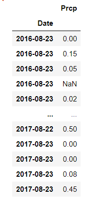
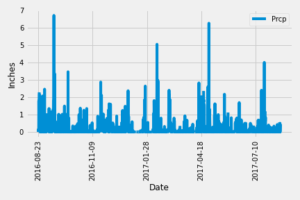
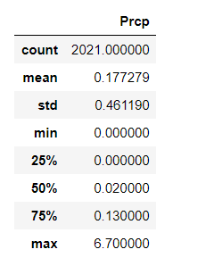
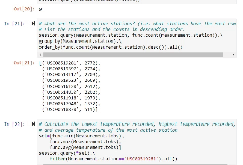
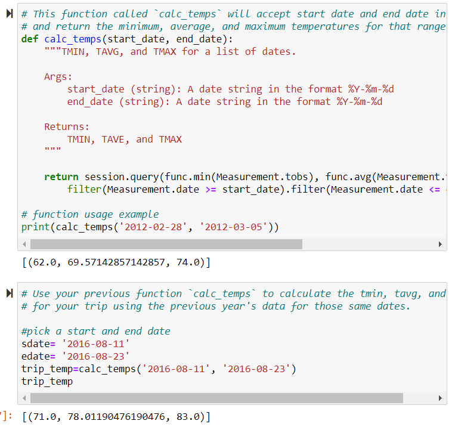
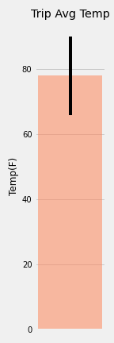
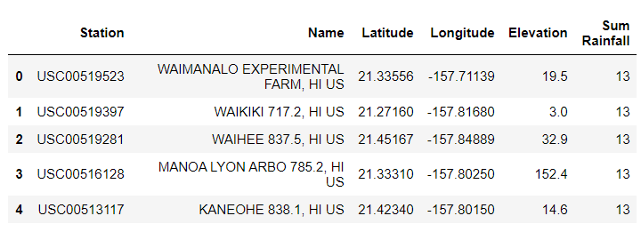

# Climate Analysis - SQLAlchemy & Python

- - -

I did a climate analysis, data exploration and Flask API on Honolulu,Hawaii.

- - -

## Climate Analysis and Exploration

* Chose a start date and end date for the trip. 

* Used SQLAlchemy `create_engine` to connect to the sqlite database.

* Used SQLAlchemy `automap_base()` to reflect the tables into classes and save a reference to those classes called `Station` and `Measurement`.

### Precipitation Analysis

* Designed a query to retrieve the last 12 months of precipitation data.

* Selected only the `date` and `prcp` values.

* Loaded the query results into a Pandas DataFrame and set the index to the date column.

* Sorted the DataFrame values by `date`.

* Plotted the results using the DataFrame `plot` method.

* Used Pandas to print the summary statistics for the precipitation data.

### Station Analysis

* Designed a query to calculate the total number of stations.

* Designed a query to find the most active stations.

  * Listed the stations and observation counts in descending order.

  * Which station has the highest number of observations.

* Designed a query to retrieve the last 12 months of temperature observation data (TOBS).

  * Filtered by the station with the highest number of observations.

  * Plotted the results as a histogram with `bins=12`.

  
  

## Climate App

Designed a Flask API based on the queries that were developed above.

* Use Flask to create your routes.

### Routes

* `/`

  * Home page.

  * Listed all routes that are available.

* `/api/v1.0/precipitation`

  * Converted the query results to a dictionary using `date` as the key and `prcp` as the value.

  * Returned the JSON representation of the dictionary.

* `/api/v1.0/stations`

  * Returned a JSON list of stations from the dataset.

* `/api/v1.0/tobs`
  * Query the dates and temperature observations of the most active station for the last year of data.
  
  * Returned a JSON list of temperature observations (TOBS) for the previous year.

* `/api/v1.0/<start>` and `/api/v1.0/<start>/<end>`

  * Returned a JSON list of the minimum temperature, the average temperature, and the max temperature for a given start or start-end range.

  * When given the start only, calculated `TMIN`, `TAVG`, and `TMAX` for all dates greater than and equal to the start date.

  * When given the start and the end date, calculated the `TMIN`, `TAVG`, and `TMAX` for dates between the start and end date inclusive.

### Temperature Analysis II

* Used the `calc_temps` function to calculate the min, avg, and max temperatures for the trip using the matching dates from the previous year.

* Plotted the min, avg, and max temperature from your previous query as a bar chart.

  * Used the average temperature as the bar height.

  * Used the peak-to-peak (TMAX-TMIN) value as the y error bar (YERR).

### Daily Rainfall Average

* Calculated the rainfall per weather station using the previous year's matching dates.

- - -
The data is provided by UCSD Extension: Data Science and Visualization Bootcamp.
- - -

Contact:

Email: arcebri1@gmail.com